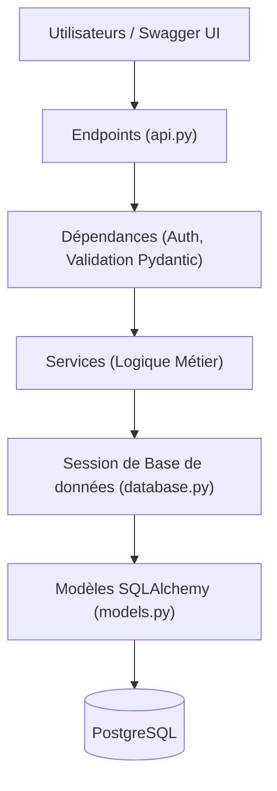

# 03 - Architecture Logicielle

## 🏗️ Architecture en Couches (Layered Architecture)
Le projet utilise une architecture multicouche pour séparer les responsabilités adaptées au paradigme de FastAPI :
- **API/Endpoints** (`api.py`) : Point d'entrée de l'API (Routage FastAPI) et injection de dépendances.
- **Services** (`services.py`) : Logique métier complète (Règles de réservation, Calculs, Validations).
- **Modèles** (`models.py`) : Définition des tables de la base de données via SQLAlchemy.
- **Schémas** (`schemas.py`) : Validation des données entrantes et sortantes via Pydantic.
- **Base de données** (`database.py`) : Connexion et session à la base de données PostgreSQL.

## 🧩 Sécurité et Validation
### Authentification JWT
L'authentification est gérée via le protocole OAuth2 avec Password Flow intégré à FastAPI. Un token JWT est généré et vérifié à chaque requête via des dépendances (Dependencies).

### Gestion des Erreurs
Côté FastAPI, les `HTTPException` sont levées directement depuis les services pour centraliser la gestion des erreurs métiers et retourner des réponses JSON cohérentes (ex: 404 Not Found, 400 Bad Request).

### Validation Pydantic
L'utilisation des modèles Pydantic (`schemas.py`) garantit que seules des données conformes entrent dans l'application, assurant un typage fort et évitant la corruption de la base de données.

---
[Précédent : Analyse Fonctionnelle](./02-analyse-fonctionnelle.md) | [Suivant : Conception des Données](./04-conception-donnees.md)
