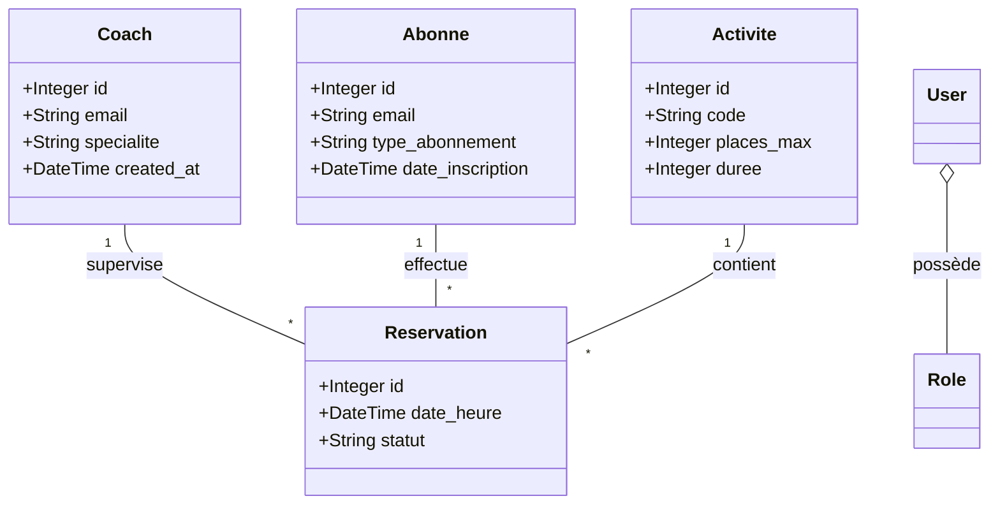

# 04 - Conception des Données

## 📊 Modèle de Données (Entities)
Le projet repose sur 4 entités principales interdépendantes :

1.  **User** : Identités, emails et rôles (`ADMIN`, `COACH`, `ABONNE`).
2.  **Coach** : Informations sur les instructeurs (Prénom, Nom, Spécialité).
3.  **Abonné** : Membres du studio avec leur type d'abonnement.
4.  **Activité** : Séances proposées (Yoga, Fitness, Musculation).
5.  **Réservation** : L'entité pivot liant un Abonné, un Coach et une Activité à une heure précise.

## 🛠️ SQLAlchemy ORM
SQLAlchemy est utilisé comme ORM pour interagir avec la base de données PostgreSQL en Python.
- **Type Safety** : Les entités Python correspondent directement aux tables SQL, avec la synchronisation du typage Pydantic.
- **Base `declarative_base`** : Structuration orientée objet pour la gestion base de données.
- **Relations** : Gestion des relations via `relationship` et `ForeignKey` (ex: Reservation lie l'ID de l'abonné et de l'activité).

---
[Précédent : Architecture Logicielle](./03-architecture-logicielle.md) | [Suivant : Infrastructure et Déploiement](./05-infrastructure-deploiement.md)
