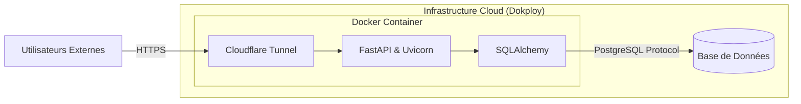

# 05 - Infrastructure et Déploiement

## 🐳 Conteneurisation (Docker)
L'application est entièrement conteneurisée pour garantir un environnement de production identique au développement.
### Dockerfile
Nous utilisons une image légère **`python:3.10-slim`** pour assurer l'efficacité et la compatibilité.
- **Étape d'Installation** : Installation des dépendances définies dans `requirements.txt`.
- **Préparation** : Variables d'environnement pour assurer l'optimisation Python (`PYTHONDONTWRITEBYTECODE`, `PYTHONUNBUFFERED`).
- **Exécution** : Application servie via le serveur ASGI **Uvicorn**.

## 🚀 Déploiement sur Dokploy
Le projet est déployé en continu sur une instance **Dokploy**.
1.  **Web Service** : L'image Docker de la branche principale est construite automatiquement par Dokploy.
2.  **Base de Données** : Utilisation d'une instance PostgreSQL connectée à l'application.

## 🌐 Exposition via Cloudflare Tunnel
Pour éviter d'exposer directement le serveur Dokploy et ses ports, le mapping vers l'application est assuré par un **Cloudflare Tunnel**. Cela garantit le HTTPS automatique et permet de n'ouvrir aucun port sur le pare-feu du serveur backend.

## 🌐 Configuration des Variables (Environment)
La sécurisation et le fonctionnement de l'API reposent sur les variables d'environnement telles que :
- `DATABASE_URL` : Chaîne de connexion PostgreSQL.
- `SECRET_KEY` : Clé de cryptage pour émettre les tokens JWT.

---
[Précédent : Conception des Données](./04-conception-donnees.md) | [Suivant : Manuel d'Utilisation](./06-manuel-utilisation.md)
